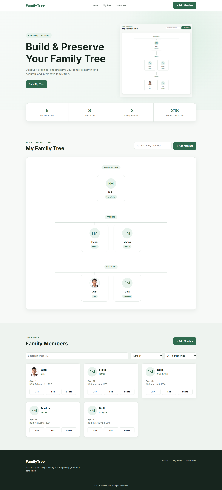

# 🌳 Dynamic Family Tree

A modern, responsive, and interactive **Family Tree web application** built using **HTML, CSS, and Vanilla JavaScript**.

The application allows users to create and manage family members, organize relationships, explore generations, search and filter members, and preserve family data directly in the browser using LocalStorage.

## ✨ Features

* 👨‍👩‍👧‍👦 Add family members
* ✏️ Edit existing members
* 🗑️ Delete family members
* 👤 View detailed member profiles
* 🌳 Interactive family tree visualization
* 🔗 Define relationships between family members
* 🔍 Search family members
* 🎯 Filter members by relationship
* 📊 Dynamic family statistics
* 🎂 Automatic age calculation
* 🖼️ Upload profile images
* 💾 LocalStorage data persistence
* 📱 Fully responsive design
* 💻 No backend or database required

## 🌿 Supported Relationships

The application currently supports:

* Grandfather
* Grandmother
* Father
* Mother
* Son
* Daughter
* Brother
* Sister
* Spouse

Members can also be connected using the **Related To** field.

## 📊 Dynamic Statistics

The dashboard automatically updates information such as:

* Total family members
* Total generations
* Family branches
* Oldest member

Statistics update whenever family members are added, edited, or removed.

## 🛠️ Technologies Used

* **HTML5** — Semantic page structure
* **CSS3** — Layout, responsive design, animations, and family tree styling
* **Vanilla JavaScript** — Application logic and DOM manipulation
* **LocalStorage** — Browser-based data persistence
* **FileReader API** — Profile image handling

No frameworks or external JavaScript libraries are required.

## 📁 Project Structure

```text id="zzsmgh"
dynamic-family-tree/
│
├── index.html
│
├── css/
│   └── style.css
│
├── js/
│   └── app.js
│
├── assets/
│   └── images/
│
└── README.md
```

## 🚀 Getting Started

### 1. Clone the repository

```bash id="fz91wy"
git clone https://github.com/YOUR-USERNAME/dynamic-family-tree.git
```

### 2. Open the project

```bash id="woxc38"
cd dynamic-family-tree
```

### 3. Run the application

Open `index.html` directly in your browser.

For development, you can also use the **Live Server** extension in Visual Studio Code.

No installation, package manager, or build process is required.

## 💡 How It Works

Click **+ Add Member** and enter the family member's information.

You can provide:

* Full name
* Profile image
* Date of birth
* Gender
* Relationship
* Related family member
* Short biography

After saving, JavaScript dynamically updates the members directory, family tree, and statistics.

## 💾 Data Storage

Family data is stored using the browser's **LocalStorage**.

This means:

* Data remains available after refreshing the page.
* No database is required.
* Data is stored locally in the current browser.
* Clearing browser storage will remove the saved family data.

## 🔎 Search & Filtering

Users can quickly find family members using the built-in search functionality.

The members directory can also be filtered by relationship, making larger family trees easier to navigate.

## 📱 Responsive Design

Dynamic Family Tree is designed to work across:

* Desktop computers
* Laptops
* Tablets
* Mobile devices

The interface automatically adapts to different screen sizes.

## 🎯 Project Purpose

This project was created to practice and demonstrate core front-end development concepts, including:

* DOM manipulation
* JavaScript events
* CRUD operations
* Arrays and objects
* Form handling
* Dynamic rendering
* Search and filtering
* Browser storage
* FileReader API
* Responsive CSS
* UI/UX design

## 🔮 Future Improvements

Possible future improvements include:

* Drag-and-drop family tree
* Advanced genealogy relationships
* Zoom and pan controls
* Import/export family data
* JSON backup and restore
* Download family tree as PDF
* Dark mode
* Multiple family trees
* Backend/database integration
* User authentication

## 🤝 Contributing

Contributions, suggestions, and improvements are welcome.

Feel free to fork the repository and submit a pull request.

## 📄 License

This project is intended for learning, practice, and portfolio purposes.

---


⭐ If you find this project useful, consider giving the repository a star!

